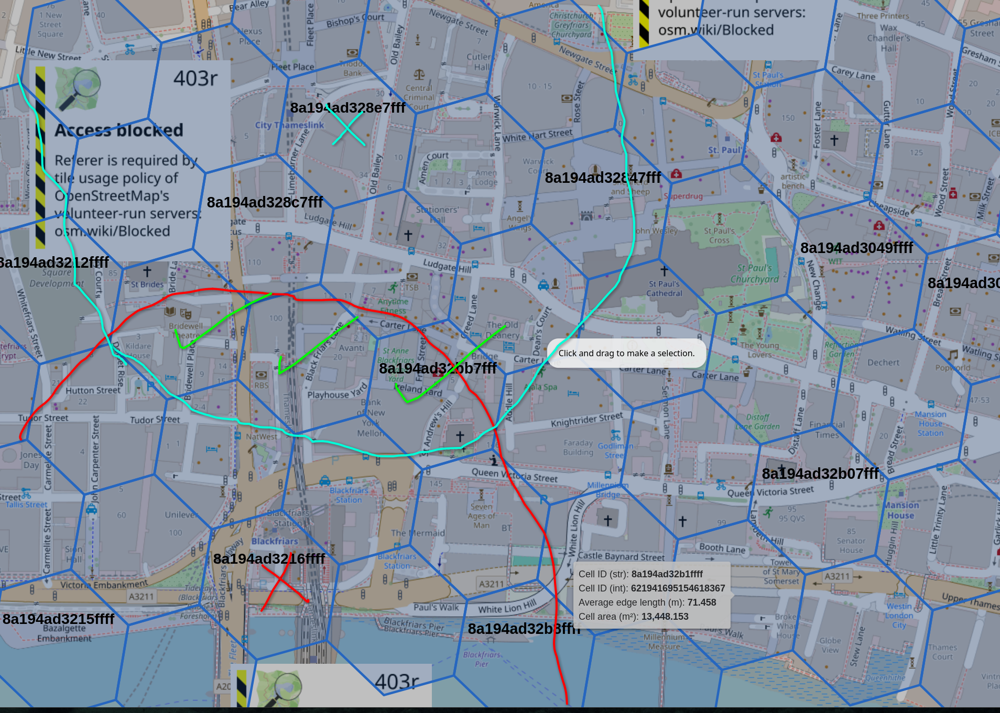

# Grouping nearby railway stations

This repository groups railway stations that are within ~500m of each other.

There can be overlap between groups if a is within 500m of b and b is within 500m of c, but a is not within 500m of c.

Each group is an array of (station name, uic code, country code)

# Generating the data

1) install `wget` and `clickhouse-local`

2) run `./generate.sh`

# Extra credit

in `scratch.sql` i have some other fun query/ies

# License

Data, ODbL 1.0 - notably using excellent [Trainline data](https://github.com/trainline-eu/stations). Code BSD-2.
